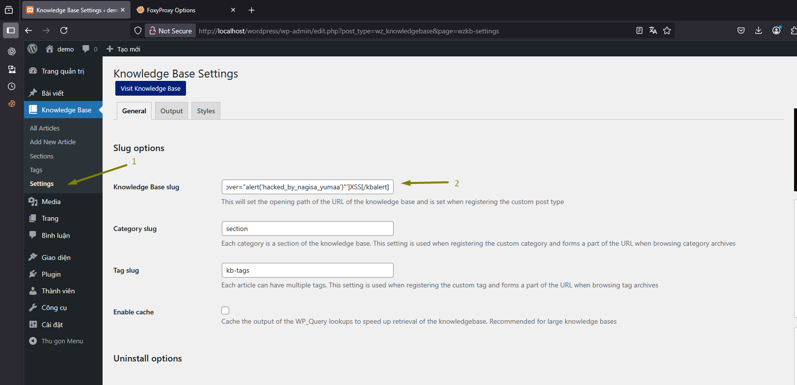
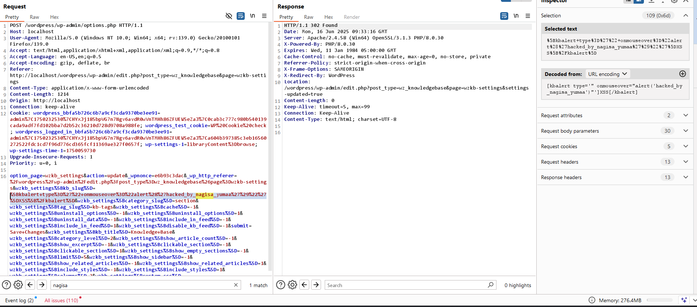
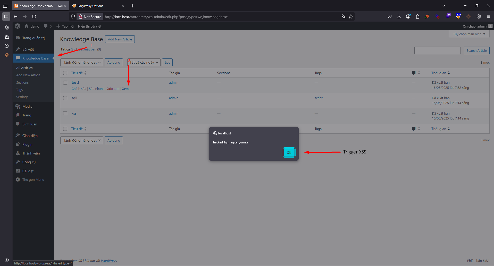

# Proof of Concept – CVE-2025-7431 Knowledge Base <= 2.3.1 - Authenticated (Administrator+) Stored Cross-Site Scripting via Plugin Slug

## CVSS:3.1/AV:N/AC:H/PR:H/UI:N/S:C/C:L/I:L/A:N ------- 4.4

## Vulnerability Overview
An authenticated attacker Administrator can exploit a Stored Cross-Site Scripting (XSS) vulnerability in the Knowledge Base plugin for WordPress by injecting malicious shortcode content into the plugin's settings.
##  Steps to Reproduce
1. The tester navigates to:
```
WordPress Admin Dashboard → Knowledge Base → Settings
```
2. In the Knowledge Base Slug field (within the Slug options section), the attacker injects the following malicious payload using the vulnerable [kbalert] shortcode:
```
[kbalert type='" onmouseover="alert('hacked_by_nagisa_yumaa')"']XSS[/kbalert]
```


3. Trigger xss
When a victim (such as an administrator or any logged-in user) accesses the “All Articles” view of the Knowledge Base, the malicious JavaScript embedded in the slug is rendered and automatically executed, triggering the attack.

## Security Impact
* Persistent XSS leads to:

    * Session hijacking

    * Admin account takeover

    * Phishing within WordPress dashboard

* The vulnerability affects all versions ≤ 2.3.1
